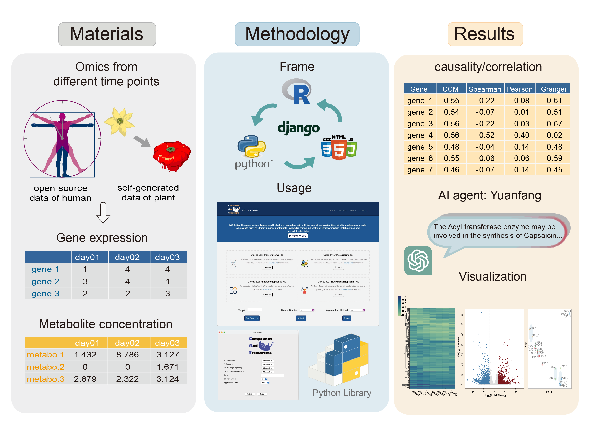

### Website
http://www.catbridge.work/

### Description

With advancements in sequencing and mass spectrometry technologies, multi-omics data can now be easily acquired for understanding complex biological systems. Nevertheless, substantial challenges remain in determining the association between gene-metabolite pairs due to the complexity of cellular networks. Here, we introduce Compounds And Transcripts Bridge (abbreviated as CAT Bridge, available at http://catbridge.work), a user-friendly platform for longitudinal multi-omics analysis to efficiently identify transcripts associated with metabolites using time-series omics data. To evaluate the association of gene-metabolite pairs, CAT Bridge is a pioneering work benchmarking a set of statistical methods spanning causality estimation and correlation coefficient calculation for multi-omics analysis. Additionally, CAT Bridge featured an artificial intelligence (AI) agent to assist users interpreting the association results. We applied CAT Bridge to self-generated (chili pepper) and public (human) time-series transcriptome and metabolome datasets. CAT Bridge successfully identified genes involved in the biosynthesis of capsaicin in *Capsicum chinense*. Furthermore, case study results showed that the convergent cross mapping (CCM) method outperforms traditional approaches in longitudinal multi-omics analyses. CAT Bridge simplifies access to various established methods for longitudinal multi-omics analysis, and enables researchers to swiftly identify associated gene-metabolite pairs for further validation.
