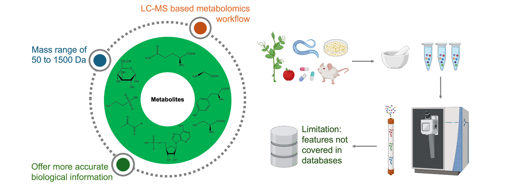
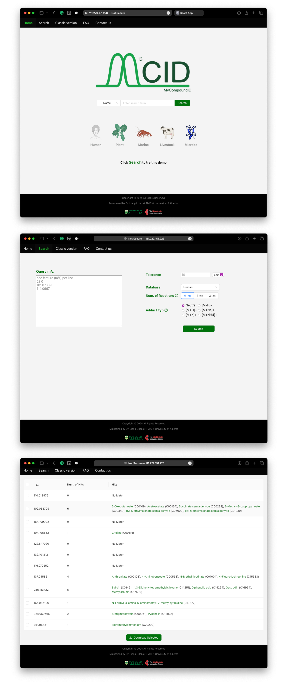
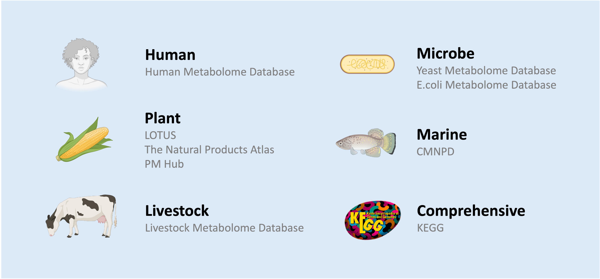
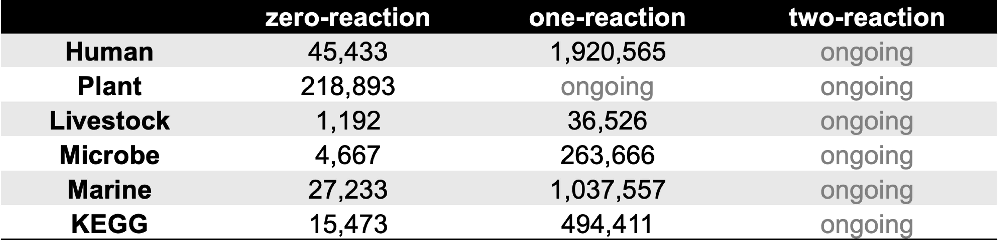

# Introduction
Lipidomics provides crucial insights into cellular processes and disease through the comprehensive analysis of lipids, primarily employing Liquid Chromatography (LC) and Mass Spectrometry (MS). A persistent challenge in these MS-based analyses is the presence of contaminants originating from experimental materials. These contaminants complicate signal interpretation and can lead to misidentification of true analytes. Unlike other MS-based fields with established contaminant databases (e.g., CRAPome for proteomics, MaConDa for metabolomics), lipidomics has lacked a dedicated software solution for contaminant identification. We introduce Lipid CAT (Contaminant Analysis Tool), novel software that matches unknown MS/MS spectra against a specialized contaminant database, significantly improving lipidomics data accuracy.

# Novel Aspects
* Expand the coverage of compounds and species to accommodate different research subjects
* Construct a scalable and maintainable rule-based reaction product prediction pipeline
* Provide a more modern, user-friendly interface applicable to various scenarios

# Preliminary Results 
MCID 2.0, an advanced cross-platform tool for metabolite identification, is developed. It features a new evidence-based metabolome database to enhance LC-MS feature identification coverage. 

We have divided our initial databases into six sections based on the type of organisms they cover, which include **Humans, Plants, Livestock, Microbes, Marine organisms, and KEGG** (a comprehensive library). After excluding lipids and disregarding stereo structures, we predicted the one-step reaction outcomes for each of these initial libraries to construct one-reaction libraries. Subsequently, we used these one-reaction libraries as substrates to predict their one-step reaction products, creating two-reaction libraries.

To facilitate the prediction of reaction products, we developed a **maintainable and scalable reaction pipeline** using [RDKit](https://www.rdkit.org). This pipeline utilizes the [Simplified Molecular Input Line Entry System (SMILES)](https://www.daylight.com/dayhtml/doc/theory/theory.smiles.html) to represent molecular structures and [SMILES Inferred Reaction Knowledge Syntax (SMIRKS)](https://www.daylight.com/dayhtml/doc/theory/theory.smirks.html) to denote reaction rules, allowing for rapid integration of new chemical transformation rules and their application to new datasets. In addition, we have **established rules for 76 common biochemical reactions**, which are currently being applied to the initial libraries.

By predicting products from these reactions, the number increases and covers a greater chemical space. This expansion can help explain some LC-MS features that were previously unannotated in the original datasets.

