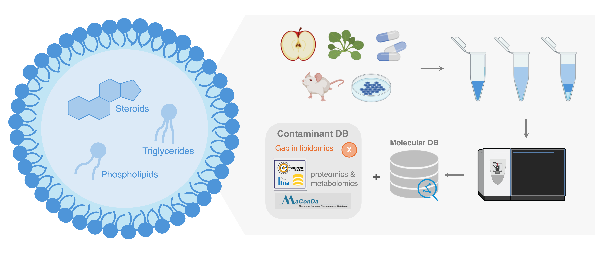
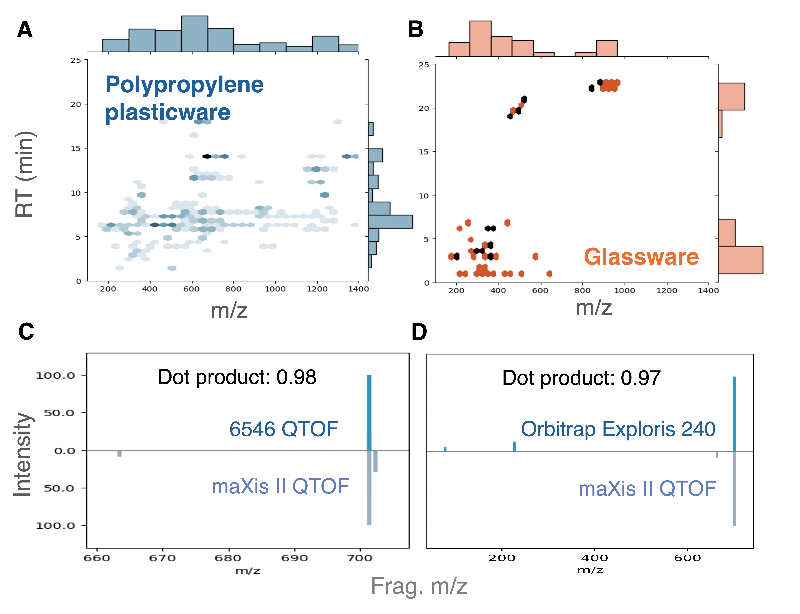
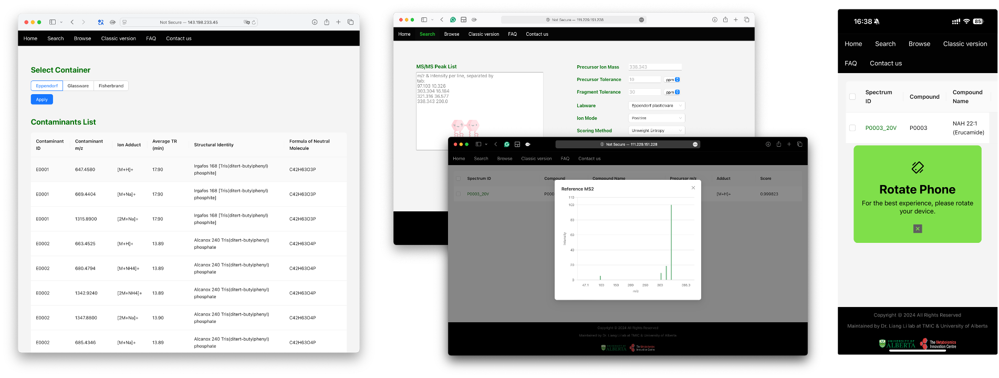
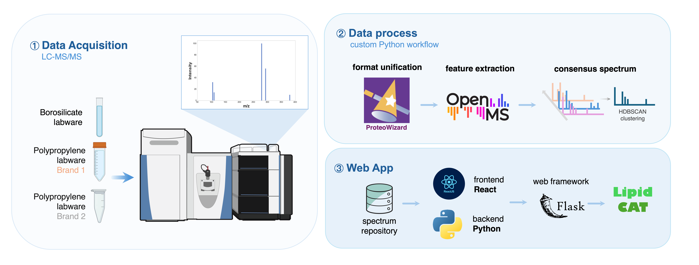
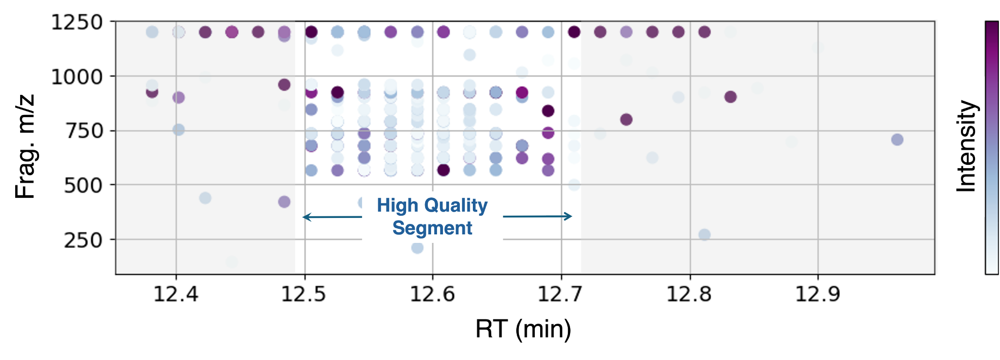

## INTRODUCTION
Lipidomics provides crucial insights into cellular processes and disease through the comprehensive analysis of lipids, primarily employing liquid chromatography (LC) and mass spectrometry (MS). A persistent challenge in these MS-based analyses is the presence of contaminants originating from experimental materials, these contaminants complicate signal interpretation and can lead to misidentification of true analytes. Unlike other MS-based fields that have established contaminant databases (e.g., CRAPome for proteomics, and MaConDa for metabolomics), lipidomics has lacked a dedicated software solution for contaminant identification. We introduce Lipid CAT (Contaminant Analysis Tool), a novel software that matches unknown MS2 spectra against a specialized contaminant database, significantly improving lipidomics data identification coverage and accuracy.

***Figure 1.** LC-MS-based lipidomics workflow and limitations*
 

## RESULTS 

* 200 ubiquitous contaminants (from 268 features) were detected in plasticware, while 53 contaminants (from 55 features) were found in glassware.
* These contaminants interfere with lipid characterization and quantification, but only 3.9% of them could be reliably identified through publicly available  MS databases.
* An MS2 data processing workflow was developed that is specifically compatible with identifying consensus spectra for low-abundance contaminants.
* A contaminant MS database was established, along with a user-friendly web application.

***Figure 2. Ubiquitous contaminants.***
***(A, B)** Contaminant distribution in various labware. **(C, D)** MS2 spectrum of an unknown contaminant (m/z = 1363.854) from diverse MS platforms.*

***Figure 3. The Lipid CAT web app interface.***
 

## METHODS
To enhance lipid identification, we developed Lipid CAT. First, Folch extraction of water blanks was performed, followed by reversed-phase UHPLC QTOF (quadrupole-time-of-flight) MS analysis, to compare polypropylene and borosilicate glass labware from various manufacturers. An HDBSCAN-based data processing workflow, suitable for compounds with varying abundances, was used to acquire MS information from representative least-leaching Eppendorf plasticware and Corning glassware. Subsequently, a database was built. We also developed a web application using React and Python to facilitate contaminant identification for users. Finally, the ubiquity of these contaminants was validated using 6546 Q-TOF, Orbitrap Exploris 240 as additional validation MS platform.

***Figure 4. Lipid CAT construction workflow.***

***Figure 5. HDBSCAN-based spectrum consensus.***
 

## ACKNOWLEDGMENTS
This work was supported by grants from the Natural Sciences and Engineering Research Council of Canada, Canadian Institutes of Health Research, Canada Foundation for Innovation, Genome Canada, Alberta Innovates and Mitacs.
 

## REFERENCE
1. Campello, R. J. G. B., et al. (2013). PAKDD. 7819, 160–172.  
2. Röst, H. L., et al. (2016). Nature Methods. 13, 9, 741–748.  
3. Canez, C. R., et al. (2024). Analytical Chemistry. 96, 8, 3544–3552.  
4. Canez, C. R., et al. (2024). Analytical Chemistry. 96, 21, 8373–8380.  