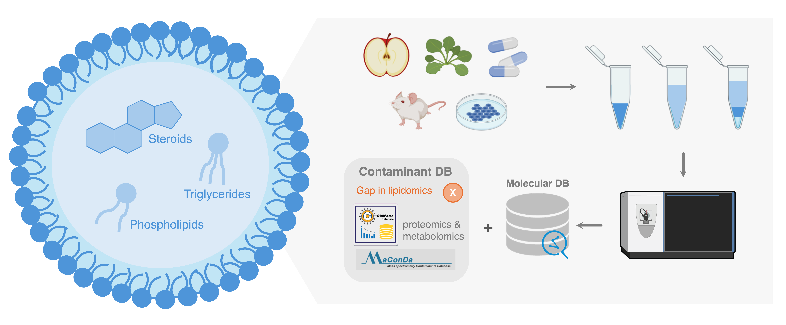

### INTRODUCTION
Lipidomics provides crucial insights into cellular processes and disease through the comprehensive analysis of lipids, primarily employing liquid chromatography (LC) and mass spectrometry (MS). A persistent challenge in these MS-based analyses is the presence of contaminants originating from experimental materials, these contaminants complicate signal interpretation and can lead to misidentification of true analytes. Unlike other MS-based fields that have established contaminant databases (e.g., CRAPome for proteomics, and MaConDa for metabolomics), lipidomics has lacked a dedicated software solution for contaminant identification. We introduce Lipid CAT (Contaminant Analysis Tool), a novel software that matches unknown MS2 spectra against a specialized contaminant database, significantly improving lipidomics data identification coverage and accuracy.

***Figure 1.** LC-MS-based lipidomics workflow and limitations*

### RESULTS 
* 200 ubiquitous contaminants (from 268 features) were detected in plasticware, while 53 contaminants (from 55 features) were found in glassware.
* These contaminants interfere with lipid characterization and quantification, but only 3.9% of them could be reliably identified through publicly available  MS databases.
* An MS2 data processing workflow was developed that is specifically compatible with identifying consensus spectra for low-abundance contaminants.
* A contaminant MS database was established, along with a user-friendly web application.

