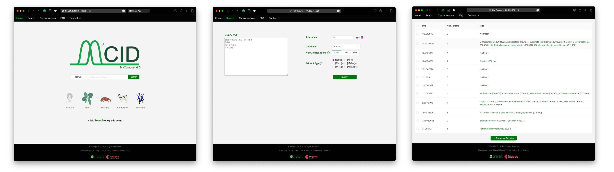

## Introduction
Metabolites play an important role in various biological functions, and the development of analytical chemistry techniques, especially Liquid Chromatography-Mass Spectrometry (LC-MS), has made high-throughput detection of metabolites possible. However, a major challenge in the field is that currently **only about 30% of features** detected by LC-MS can be identified, most features are “dark matter” due to the absence of corresponding matches in databases. To tackle these issues, the MyCompoundID (MCID) was developed. It employs the prediction of biochemical reaction products to expand metabolites coverage, and has been widely used, garnering over 610 citations. However, the last update to MCID was nine years ago. Recognizing advancements in metabolomics in recent years, especially as **new metabolites** from different species have been discovered, and **new cheminformatics methods** have been developed, we have updated and introduced MCID 2.0, the new version of this tool, to improve the accuracy of predicted products and to expand their application scope.

## Novel Aspects
* Expand the coverage of compounds and species to accommodate different research subjects
* Construct a scalable and maintainable rule-based reaction product prediction pipeline
* Provide a more modern, user-friendly interface applicable to various scenarios

## Methods
The construction of MCID 2.0 involves three components: the creation of the initial library, the prediction of reaction products, and the software implementation.
**Initial library:**
The initial library is divided into different sections based on the diversity of the species included, with each section assembled by combining multiple databases via InChIKey.
**Products prediction: **
Based on this, the products of reactions are predicted using RDKit to build the one and two reaction libraries. The reaction rules are represented by line notation, and based on these rules, we developed a comprehensive pipeline to generate the predicted product dataset.
**Software implementation: **
Two usage modes for MCID 2.0 are created: a web server and a standalone application. SQLite manages the database behind MCID 2.0, while Python powers the backend functions. The web server version is built with the Flask framework and connects the backend to a React-based frontend. The standalone application's graphical user interface is created using TKinter.

## Preliminary Results 
We have divided our initial databases into six sections based on the type of organisms they cover, which include **Humans, Plants, Livestock, Microbes, Marine organisms, and KEGG** (a comprehensive library). After excluding lipids and disregarding stereo structures, we predicted the one-step reaction outcomes for each of these initial libraries to construct one-reaction libraries. Subsequently, we used these one-reaction libraries as substrates to predict their one-step reaction products, creating two-reaction libraries.

To facilitate the prediction of reaction products, we developed a **maintainable and scalable reaction pipeline** using RDKit. This pipeline utilizes the Simplified Molecular Input Line Entry System (SMILES) to represent molecular structures and SMILES Inferred Reaction Knowledge Syntax (SMIRKS) to denote reaction rules, allowing for rapid integration of new chemical transformation rules and their application to new datasets. In addition, we have **established rules for 76 common biochemical reactions**, which are currently being applied to the initial libraries.

By predicting products from these reactions, the number increases and covers a greater chemical space. This expansion can help explain some LC-MS features that were previously unannotated in the original datasets.

