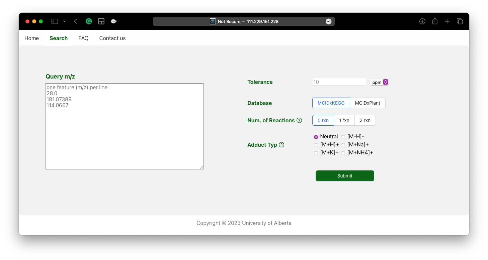

Metabolites play an important role in various biological functions, and the development of analytical chemistry techniques, especially Liquid Chromatography-Mass Spectrometry (LC-MS), has made high-throughput detection of metabolites possible. However, a major challenge in the field is that currently only about 30% of features detected by LC-MS can be identified, most features are "dark matter" due to the absence of corresponding matches in databases. Also, although many databases have been created and a huge number of compounds are present, there are no uniform naming standards among them, making manual large-scale searching a highly time-consuming and error-prone task.  

To tackle these issues, we integrated resources from different databases through [InChIKey](https://www.inchi-trust.org), and predicting biochemical reaction products using [RDKit](https://www.rdkit.org) to construct 1 reaction and 2 reaction libraries. This approach expands the identification coverage. Following this concept, we are developing **[MCID 2.0](http://111.229.151.228:5000)** and **[LIME](https://github.com/Bowen999/LIME)**.

